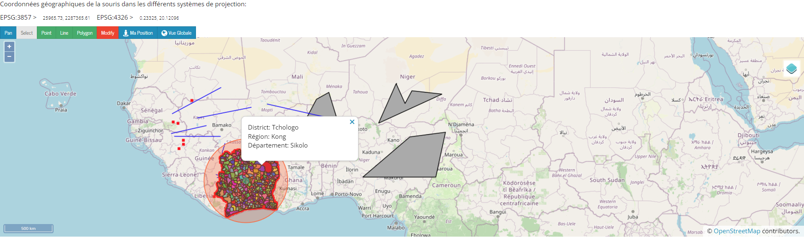

# OpenLayers Web Mapping Project

Welcome to the OpenLayers Web Mapping Project! This project utilizes OpenLayers, a powerful open-source JavaScript library, to create dynamic and interactive web mapping applications. The purpose of this project is to provide a learning resource for developing web mapping applications using OpenLayers along with other web technologies such as HTML5, Bootstrap, jQuery, etc. The application includes layers created and published using GeoServer.

## Prerequisites

Before running the project, ensure you have the following dependencies installed:

1. **PostgreSQL:**
   - Install PostgreSQL on your machine.
   - Ensure PostgreSQL is running.
   - Make sure to set up the same credentials in the project code.

2. **Node js:**
   - Install Node JS on your machine.
   - Start Node JS (check the ports ).
3. **Geoserver:**
   -Start Geoserver and complete the part of  loading  and publishing  vector and raster data on GeoServer

## ScreenShots related tp the project : 

